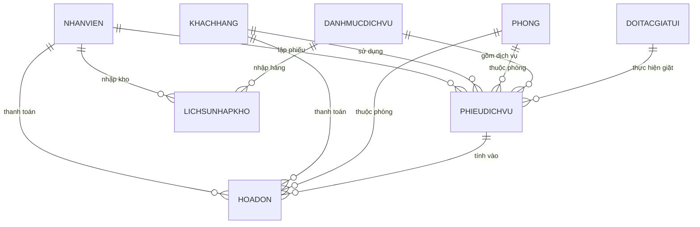

# 🏨 Hệ Thống Quản Lý Dịch Vụ Khách Sạn Pro (QuanLyDichVuKhachSan)


> **Hệ thống Quản lý Khách sạn & Doanh thu Dịch vụ toàn diện** được xây dựng trên nền tảng **.NET 9.0 WinForms** kết hợp với **Microsoft SQL Server**, quản lý tự động hóa dựa trên 8 bảng thực thể mạnh cốt lõi, 2 Triggers tự động và 6 Stored Procedures báo cáo thống kê chuyên sâu.

---

## 🌟 Tính Năng Nổi Bật (Key Features)

### 🔐 1. Đăng Nhập & Phân Quyền Vai Trò (Authentication & RBAC)
- Đăng nhập bảo mật theo tài khoản Nhân viên (`NhanVien`).
- Phân quyền giao diện tự động theo chức vụ (**Admin** vs **Lễ Tân**).
- Quản lý lịch phân ca trực (**Ca Sáng**, **Ca Chiều**, **Ca Đêm**).
- Tích hợp nút **⚡ Demo Quick Login** cho Admin & Lễ Tân trên màn hình đăng nhập.

### 🚪 2. Sơ Đồ Phòng Trực Quan (Interactive Room Map)
- Thống kê tổng quan trạng thái phòng realtime: **Trống** (Xanh lá), **Đang sử dụng** (Xanh dương), **Đang dọn dẹp** (Vàng), **Bảo trì** (Đỏ).
- Cấu hình giá phòng theo **Giờ (VNĐ/Giờ)** và **Ngày (VNĐ/Ngày)**.
- Đổi trạng thái phòng nhanh và phím tắt chuyển sang **Lập phiếu dịch vụ cho phòng này**.

### 🍽️ 3. Danh Mục Dịch Vụ 6 Nhóm (Service Catalog)
- Quản lý dịch vụ phân nhóm đa dạng:
  1. 🍜 **Ăn uống tươi** (Phở bò, Cà phê...) - Theo suất ăn/ngày.
  2. 🥤 **Thực phẩm khô** (Coca Cola, Mì gói...) - Quản lý tồn kho tự động.
  3. 🛵 **Cho thuê xe** (Xe máy, Ô tô) - Theo dõi biển số & trạng thái.
  4. 🏛️ **Sảnh sự kiện** (Ballroom, Hội nghị) - Theo dõi sức chứa & thiết bị.
  5. 🅿️ **Bãi đỗ xe** (Xe máy, Ô tô hầm).
  6. 🧺 **Giặt ủi ngoại** - Liên kết đối tác ăn chia.
- Công tắc bật/tắt kích hoạt dịch vụ (`IsActive`).

### 📋 4. Động Cơ Giao Dịch Phiếu Dịch Vụ (Service Usage Engine)
- Ghi nhận lượt sử dụng dịch vụ (`PhieuDichVu`) của khách hàng.
- **Tự động hóa bằng SQL Trigger `trg_XuLyPhieuDichVu`**:
  - Tự động tính tổng tiền: `TongTien = (SoLuong * DonGia) + ThuThemPhatSinh`.
  - Tự động trừ tồn kho thực phẩm khô.
  - Tự động tính tỷ lệ phân chia doanh thu giữa Khách sạn và Đối tác giặt ủi (`TienKhachSanNhan` vs `TienDoiTacNhan`).
- Hỗ trợ hình thức tính: **Hóa đơn riêng** hoặc **Tính gộp vào tiền phòng**.

### 📦 5. Quản Lý Nhập Kho Thực Phẩm (Inventory Stocking)
- Dành riêng cho Admin thực hiện nhập hàng đồ khô (`LichSuNhapKho`).
- **SQL Trigger `trg_CapNhatTonKho_KhiNhapMoi`** tự động cộng dồn tồn kho vào danh mục dịch vụ ngay khi thêm bản ghi nhập kho.

### 🧺 6. Quản Lý Đối Tác Giặt Ủi (Laundry Partners)
- Quản lý danh sách các xưởng giặt ủi đối tác (`DoiTacGiatUi`).
- Cấu hình linh hoạt **Tỷ lệ % ăn chia của Khách sạn (`TyLeAnChiaKhachSan`)**.

### 💳 7. Hóa Đơn & Thanh Toán Tổng Hợp (Invoicing & Settlement)
- Lập hóa đơn gộp theo loại: *Ăn uống, Sự kiện, Thuê xe, Bãi đỗ xe, Giặt ủi, Tổng hợp*.
- Hỗ trợ đa dạng phương thức thanh toán: **Tiền mặt**, **Chuyển khoản**, **Thẻ**.

### 📊 8. Dashboard Báo Cáo Thống Kê Chuyên Sâu (Executive Analytics)
- Chạy trực tiếp 6 SQL Server Stored Procedures với bộ lọc khoảng thời gian (`@TuNgay`, `@DenNgay`):
  1. `sp_ThongKeDoanhThuChung`: Tổng quan doanh thu theo từng nhóm dịch vụ.
  2. `sp_ThongKeAnUong`: Doanh thu ăn uống & chi tiết tồn kho tiêu thụ.
  3. `sp_ThongKeThueXe`: Số lượt thuê xe & ghi nhận hư hại/mất mát.
  4. `sp_ThongKeSuKien`: Số lượt thuê sảnh sự kiện & ghi nhận hư hại tài sản.
  5. `sp_ThongKeDoXe`: Số lượt gửi xe & ghi nhận sửa chữa bãi đỗ.
  6. `sp_ThongKeGiatUi`: Thống kê sản lượng Kg giặt, tổng doanh thu & tiền trả đối tác.

---

## 🏗️ Kiến Trúc Cơ Sở Dữ Liệu (Database Architecture)

Hệ thống được thiết kế tối ưu dựa trên đúng **8 bảng thực thể mạnh cốt lõi**:



### Các bảng CSDL (8 Strong Entities):
1. `NhanVien`: Quản lý admin, lễ tân, tài khoản, ca trực, trạng thái.
2. `KhachHang`: Quản lý thông tin khách hàng (Họ tên, CCCD, SĐT, Địa chỉ).
3. `Phong`: Quản lý sơ đồ phòng, loại phòng, giá giờ/ngày, trạng thái sử dụng.
4. `DanhMucDichVu`: Quản lý 6 nhóm dịch vụ, đơn giá, tồn kho, suất ăn, trạng thái.
5. `DoiTacGiatUi`: Quản lý đối tác giặt ủi ngoài & tỷ lệ % ăn chia.
6. `PhieuDichVu`: Thực thể giao dịch quản lý lượt dùng dịch vụ của khách.
7. `LichSuNhapKho`: Quản lý lịch sử nhập kho thực phẩm do Admin thực hiện.
8. `HoaDon`: Quản lý hóa đơn tổng hợp & trạng thái thanh toán.

---

## 🔑 Tài Khoản Mẫu (Demo Credentials)

CSDL đã được khởi tạo sẵn bộ dữ liệu mẫu (Seed Data) để trải nghiệm ngay:

| Tên Đăng Nhập | Mật Khẩu | Họ Và Tên | Chức Vụ | Ca Trực |
| :--- | :--- | :--- | :--- | :--- |
| `admin` | `YourPassword123!` | Chủ Khách Sạn - Admin | **Admin** | Ca Sáng |
| `letana` | `123456` | Lễ Tân Nguyễn Văn A | **Lễ tân** | Ca Sáng |
| `letanb` | `123456` | Lễ Tân Trần Thị B | **Lễ tân** | Ca Chiều |

---

## 🚀 Hướng Dẫn Cài Đặt & Chạy Ứng Dụng (Setup & Run)

### Yêu cầu hệ thống (Prerequisites)
- **Hệ điều hành**: Windows 10/11
- **Runtime**: [.NET 9.0 SDK](https://dotnet.microsoft.com/download/dotnet/9.0)
- **Database Engine**: Microsoft SQL Server 2019/2022 hoặc SQLEXPRESS (đã bật Localhost `.` hoặc `localhost`).

### Bước 1: Clone Repository
```bash
git clone https://github.com/NNBLong68/QuanLyDichVuKhachSan.git
cd QuanLyDichVuKhachSan
```

### Bước 2: Khởi tạo CSDL SQL Server
Mở terminal và chạy lệnh thực thi script SQL (hỗ trợ UTF-8 65001):
```powershell
sqlcmd -S . -E -f 65001 -i QuanLyKhachSanDB.sql
```

### Bước 3: Biên dịch & Chạy Ứng Dụng
```bash
# Biên dịch dự án
dotnet build

# Chạy ứng dụng WinForms
dotnet run
```

---

## 🛠️ Công Nghệ Sử Dụng (Tech Stack)

- **Language**: C# 12 (.NET 9.0 WinForms)
- **Data Access**: `Microsoft.Data.SqlClient` 5.2.2 (ADO.NET)
- **Database**: Microsoft SQL Server (T-SQL, Triggers, Stored Procedures)
- **UI Design**: Modern Dark Theme (#0F172A), Slate Panels (#1E293B), Emerald Accent (#10B981)
